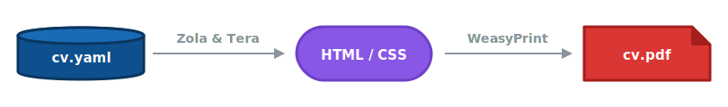

# Curriculum Vitae

My CV, built using an HTML/CSS to PDF pipeline.

_Heavily inspired by / copied from [The Overengineered Resume](https://ktema.org/articles/the-overengineered-resume/)._

## Architecture



- **Data:** Content is decoupled from presentation and stored in `cv.yaml` following the [JSON Resume](https://jsonresume.org/) schema.
- **Templating:** [Zola](https://www.getzola.org/) reads the YAML and generates semantic HTML using a Tera template.
- **Styling:** Standard CSS with paged media rules (`@page`) and responsive media queries styles the CV simultaneously for print (A4) and screens.
- **PDF Generation:** [WeasyPrint](https://weasyprint.org/) renders the HTML/CSS into a deterministic, high-quality, ATS-parsable PDF.
- **Reproducibility:** A [Nix](https://nixos.org/) flake guarantees a reproducible environment containing the exact versions of Zola, WeasyPrint, and the required IBM Plex fonts, removing any dependency on host-installed tools.
- **CI/CD:** GitHub Actions automatically lints formatting (via `treefmt`), checks grammar/spelling (via `typos` and `LanguageTool`), builds the PDF, and deploys both the HTML web version and PDF to GitHub Pages.

## Local Development

To build the CV locally, you just need [Nix](https://nixos.org/download.html) (with flakes enabled):

```bash
# Run the default app to build the HTML and generate `cv.pdf` in the current directory
nix run .

# Or build the derivation into a `result/` symlink
nix build .#cv

# Run the strict formatting and grammar checks
nix flake check
```

To enter the development shell (which provisions `zola`, `weasyprint`, `languagetool`, and fonts):

```bash
nix develop
```

## Live Version

Published to [cv.awicks.io](https://cv.awicks.io) using GitHub Pages.
